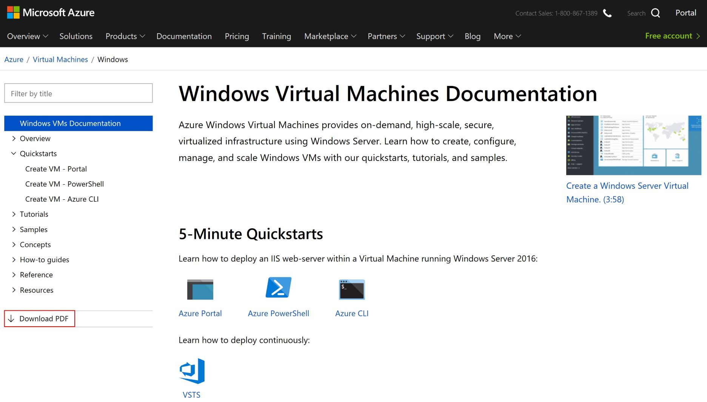

# Download Azure documentation for offline view with PowerShell script
Microsoft hosts Azure documentation on https://docs.microsoft.com/en-us/azure/. Each topic has a rendered PDF file associated which can be downloaded for offline view a shown on picture below (screenshot of https://docs.microsoft.com/en-us/azure/virtual-machines/windows/).

You can download documentation separately using download links. But sometimes there is a need to download ALL Azure documents to mantain it for offline reference.
I found a nice one-liner from Michael Crump - [Azure Tips and Tricks Part 128 - Download all Azure Documentation for offline viewing](https://www.michaelcrump.net/azure-tips-and-tricks128/)) - but Windows Subsystem for Linux (WSL) is required to run it on Windows.
Kudos to Michael for providing URIs required for download.

I wanted to make it possible to run it in PowerShell and since I have not found any existing published scripts, I decided to make it my first GitHub repo.

The script uses Invoke-WebRequest cmdlet and downloads each file separately.

You can download the script and enhance it per your requirements.

